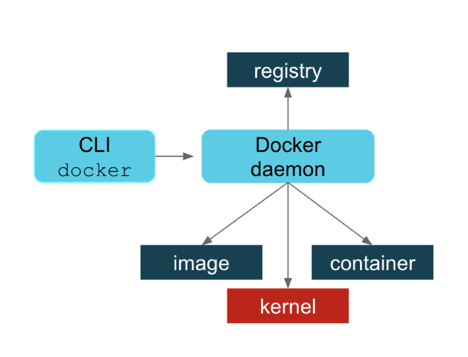
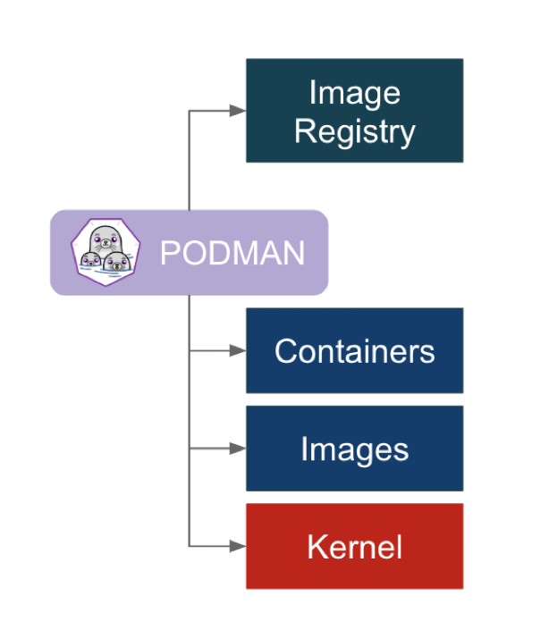
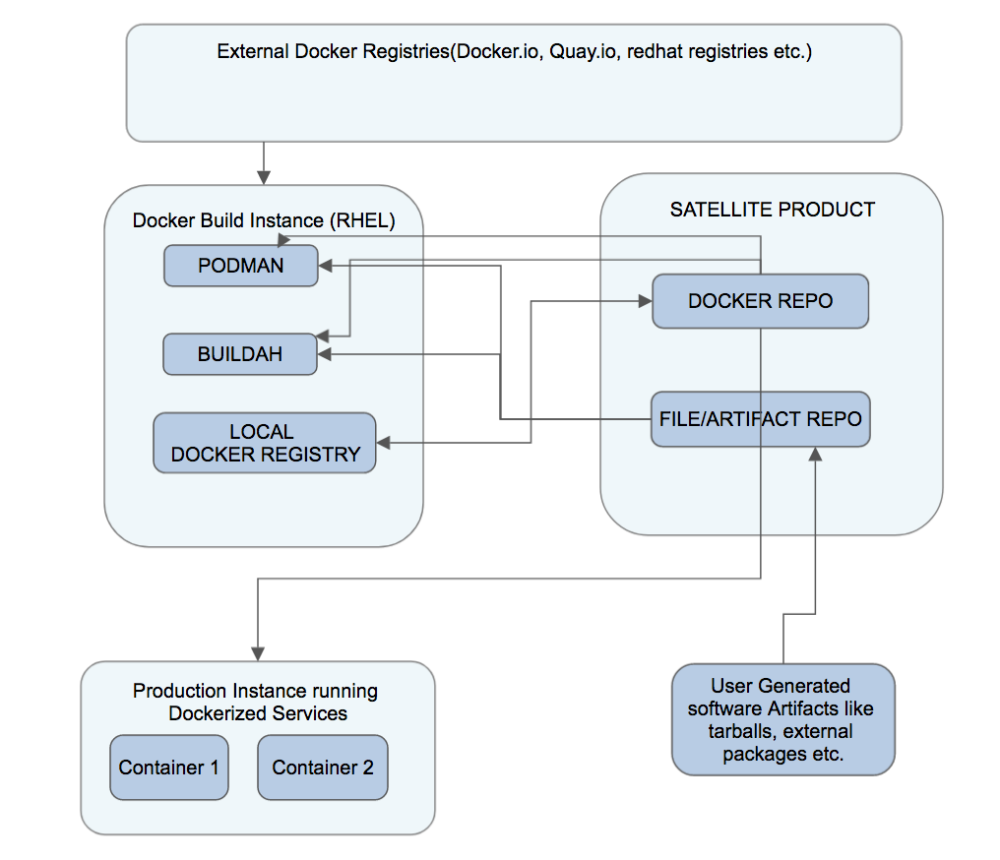

# Introducing tools like Podman, buildah to containerize services.
  * Buildah and Podman are two complementary open-source projects
  * Buildah specializes in building OCI images without requiring a daemon.
  * Buildah also intends to allow usage of different scripting languages other
  than just dockerfile to create images.
  * Podman specializes in all of the commands and functions to create, run,
  and maintain those containers
  * Starting with the Stein release, Docker is no longer part of OpenStack,
  and Podman has taken its place.

Lets begin with a context to put the tools in perspective.

# Basic Docker workflow

1. Docker daemon does all things for you.
    * Pull and push images from an image registry
    * Make copies of images in a local container storage and to add layers to
    those containers
    * Commit containers and remove local container images from the host
    repository
    * Ask the kernel to run a container with the right namespace and cgroup,
    etc.
2. CONS.
    * A single process could be a single point of failure.
    * This process owned all the child processes (the running containers).
    * If a failure occurred, then there were orphaned processes.
    * Building containers led to security vulnerabilities.
# Podman workflow

3. Podman addresses some of the issues with Docker.
   * The Podman approach is simply to directly interact with the image registry,
   with the container and image storage, and with the Linux kernel through the
   runC container runtime process (not a daemon).

4. Notes on Podman
   * You install Podman instead of Docker. A drop in replacement.
   * You do not need to start or manage a daemon process like the Docker daemon.
   * The commands you are familiar with in Docker work the same for Podman.
   * Podman stores its containers and images in a different place than Docker.
   * Podman and Docker images are compatible.
   * Podman does more than Docker for Kubernetes environments.
   * Podman’s local repository is in /var/lib/containers

# Basic workflow in our environments.


5. Notes on satellite hosted Docker repo.
   * Allows import of images from external repositories.
   * It can act as an image registry but, hosts cannot push changes back to the
   registry
   * Satellite needs an upstream to sync to.

# Into the thick of actions, BUILDING IMAGES with BUILDAH cli.

6. Just get started with working on Base Images from various upstream
   repositories
   * List any containers running under buildah, remember buildah and podman
   cannot see each other's running containers.

   ```
   # buildah list
   CONTAINER ID  BUILDER  IMAGE ID     IMAGE NAME                       CONTAINER NAME
   # container=$(buildah from ubuntu:18.04)
   Instant ability to play with images by providing you with a temp running container.
   # buildah list
   CONTAINER ID  BUILDER  IMAGE ID     IMAGE NAME                       CONTAINER NAME
   6ce3b8135a22     *     4e5021d210f6 docker.io/library/ubuntu:18.04   ubuntu-working-container

   This temporary container allows you to test a quick command and build a
   Dockerfile in an incremental way.
   # buildah run $container bash -c "apt-get update && apt-get install -y \
   python-pip

   Do your thing and you can directly commit to a new-image
   # buildah commit $container new-image
   Getting image source signatures
   Copying blob c8be1b8f4d60 skipped: already exists
   Copying blob 977183d4e999 skipped: already exists
   Copying blob 6597da2e2e52 skipped: already exists
   Copying blob 16542a8fc3be skipped: already exists
   Copying blob 8ef146dc02db done
   Copying config e8ecc8bc0e done
   Writing manifest to image destination
   Storing signatures
   e8ecc8bc0eed63cb54738922e9f6e17f837098933111f6fd98e1f109e733d34c

   # buildah images
   REPOSITORY                 TAG      IMAGE ID       CREATED          SIZE
   localhost/new-image        latest   e8ecc8bc0eed   40 seconds ago   94.9 MB
   ```

   * Now as an example, say you are on the mycloud docker build instance/VM and
   you are ready to push an image from the local repo to the docker repo(which
   acts as an upstream to the satellite repo) then you would run a command as
   below.
   ```
   # buildah push --tls-verify=false localhost/new-image localhost:5000/new-image:latest
   ```
   this will immediately also make the image available in satellite repo.

   * Another example demonstrating the mount option that opens up the base image
   on the filesystem tree and allows you to manipulate the image using the tools
   installed and available on your host without having to install them inside
   of the image.
   ```
   #!/usr/bin/env bash
   set -o errexit

   # Create a container
   container=$(buildah from scratch)

   # Mount the container filesystem
   mountpoint=$(buildah mount $container)

   # Install a basic filesystem and minimal set of packages, and nginx
   dnf install --installroot $mountpoint  --releasever 28 glibc-minimal-langpack nginx --setopt install_weak_deps=false -y

   # Save the container to an image
   buildah commit --format docker $container nginx

   # Cleanup
   buildah unmount $container

   # Push the image to the Docker daemon’s storage
   buildah push nginx:latest docker-daemon:nginx:latest
   ```

# A Dockerfile example demonstrates some usage hints.

   * Usage hints such as with the chaining of commands to package your
   application in the way the RUN command is used allows you to limit layers
   on your final image thereby limiting the size of your final image.
   * Using an ARG allows you to use variables in the Dockerfile.
   * Using dumb-init as a PID supervisor.
   * Demonstrates fetching a package from a file repo on satellite.

      ```
      # ls
      Dockerfile  dumb-init_1.2.2_amd64.deb
      # cat Dockerfile
      FROM ubuntu:18.04
      ARG var
      ENV DEBIAN_FRONTEND=${var}
      RUN apt-get update && apt-get install -y \
        python-pip \
        curl \
        wget \
        && pip install python-glanceclient==2.16.0 python-neutronclient==6.12.0\
        && rm -rf /var/lib/apt/lists/* \
        && wget https://github.com/Yelp/dumb-init/releases/download/v1.2.2/dumb-init_1.2.2_amd64.deb \
        && dpkg -i dumb-init_*.deb \
        && rm -f dumb-init_*.deb \
        && mkdir -p /usr/src/mycloud \
        && curl http://ind1-satellite.mgmt.mycloud.com/pulp/isos/mycloud/Library/custom/automation/mycloud-packages/mycloud_automation-mycloud-common-0.1.10.tar.gz \
        | tar -xzC /usr/src/mycloud \
        && cd /usr/src/mycloud/mycloud_automation-mycloud-common-0.1.10/mycloud_common \
        && python setup.py install \
        && rm -fr /usr/src/mycloud/mycloud_automation-mycloud-common-0.1.10
      ENTRYPOINT ["dumb-init","--single-child","--"]
      CMD tail -f /dev/null
      ```
    * Now the build part
      ```
      # buildah bud --build-arg var=noninteractive -t demonow .
      Output omitted...

      # buildah images
      REPOSITORY                                                                    TAG        IMAGE ID       CREATED        SIZE
      localhost/demonow                                                             latest     93d596f8e096   4 days ago     546 MB
      ```
# Not limited to just using Dockerfiles to build images, BASH example below.

    * We could as well use image building as part of bash scripts.
    * Ability to use them in bash scripts and potentially other scripting
    languages could be useful whn building CI/CD pipelines.
    * Buildah cli provides equivalent of most Dockerfile commands.

    Below is an equivalent bash script. Run this script and you have a new
    image in your local repo.

      ```
      #!/usr/bin/env bash

      set -o errexit

      container=$(buildah from ubuntu:18.04)
      mountpoint=$(buildah mount $container)

      wget -P ${mountpoint}/tmp https://github.com/Yelp/dumb-init/releases/download/v1.2.2/dumb-init_1.2.2_amd64.deb
      chroot ${mountpoint} bash -c "mkdir /usr/src/mycloud"
      curl http://ind1-satellite.mgmt.mycloud.com/pulp/isos/mycloud/Library/custom/automation/mycloud-packages/mycloud_automation-mycloud-common-0.1.10.tar.gz \
      | tar -xzC ${mountpoint}/usr/src/mycloud


      buildah config --env DEBIAN_FRONTEND=noninteractive ${container}
      buildah run $container bash -c "apt-get update && apt-get install -y \
        python-pip \
        && pip install python-glanceclient==2.16.0 python-neutronclient==6.12.0\
        && rm -rf /var/lib/apt/lists/* \
        && dpkg -i /tmp/dumb-init_*.deb \
        && rm -f /tmp/dumb-init_*.deb \
        && cd /usr/src/mycloud/mycloud_automation-mycloud-common-0.1.10/mycloud_common \
        && python setup.py install \
        && rm -fr /usr/src/mycloud/mycloud_automation-mycloud-common-0.1.10"
      buildah config --entrypoint '["dumb-init","--single-child","--"]' $container
      buildah config --cmd "tail -f /dev/null" $container
      buildah commit $container demo2
      ```

    * Futher reading.
    Using systemd for running and managin containers.
    https://access.redhat.com/documentation/en-us/red_hat_enterprise_linux/8/html/building_running_and_managing_containers/using-systemd-with-containers_building-running-and-managing-containers
